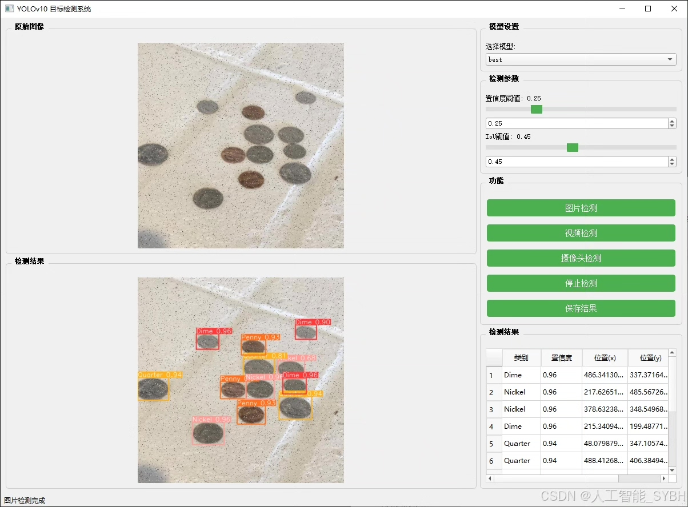
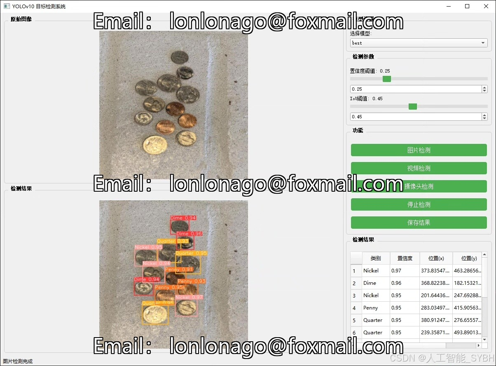
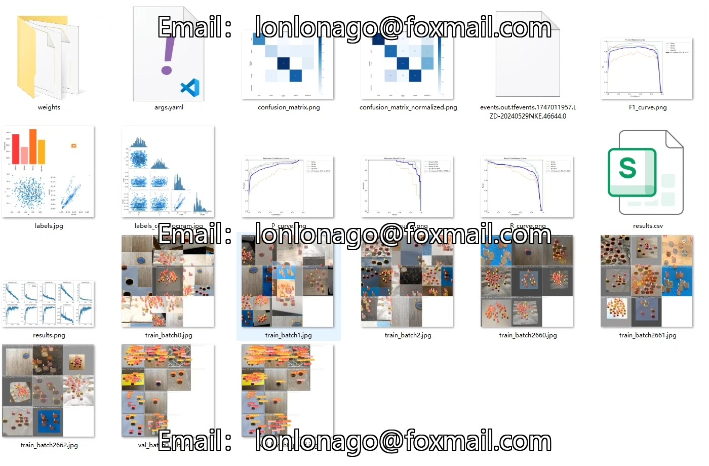
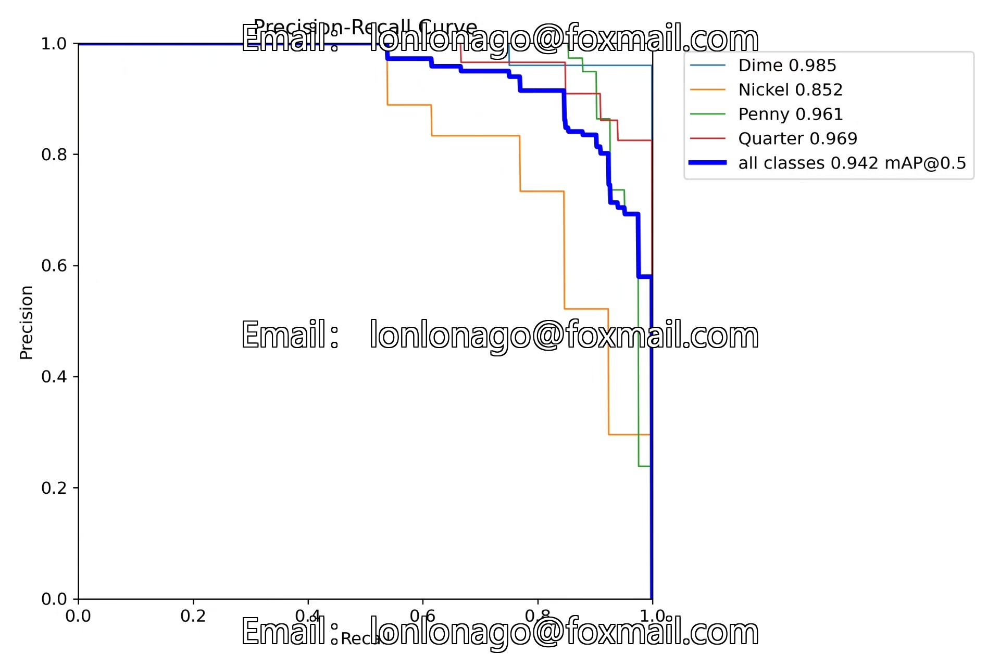
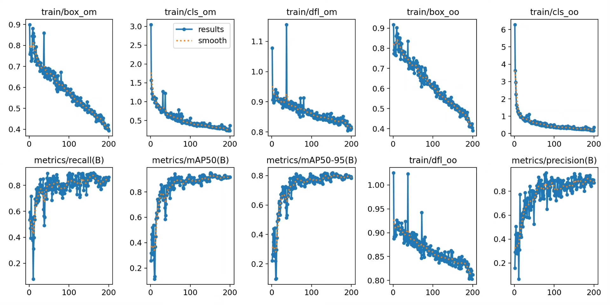
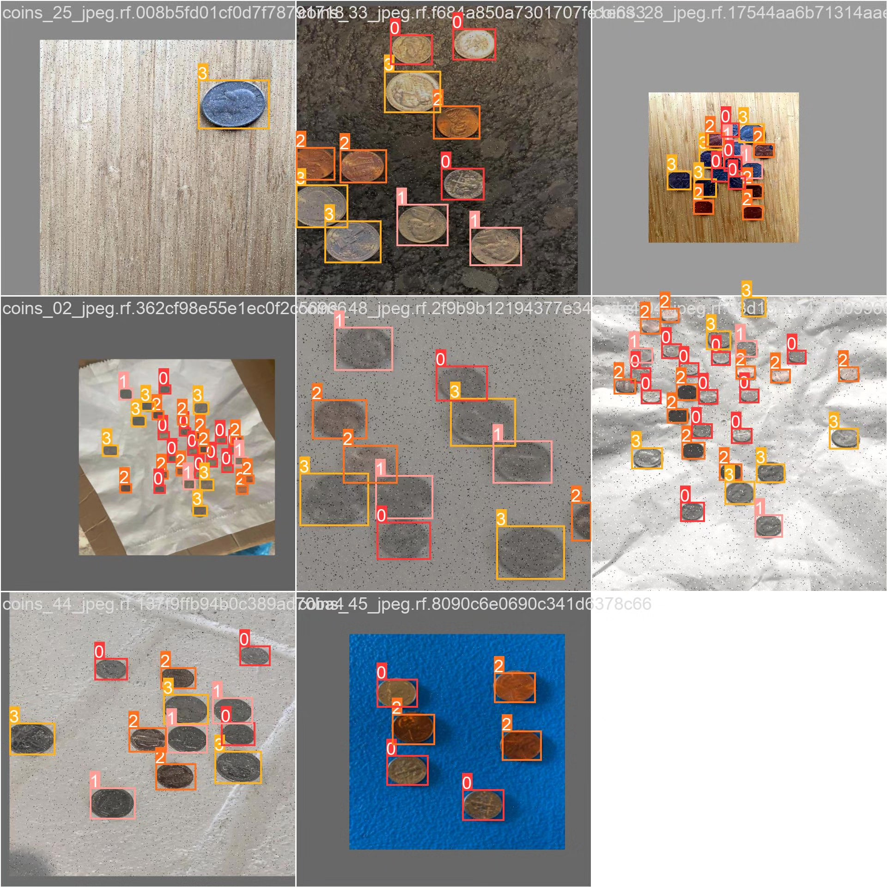
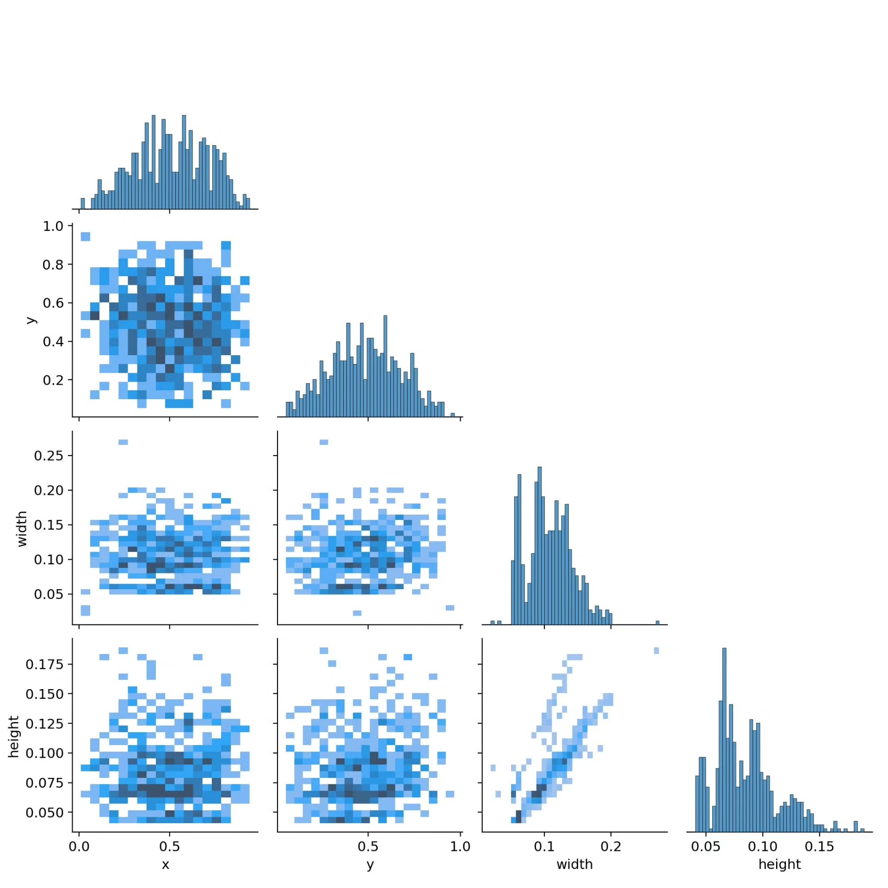

# YOLOv10-based American coin recognition detection system based on deep learning

## Body

Based on the advanced YOLOv10 object detection algorithm, this project has developed a high-precision American coin recognition and detection system. It can accurately recognize and classify four common American coins: 1 Penny, 5 Nickel, 10 Dime, and 25 Quarter. The system has been optimized for special challenges in coin detection, including metal reflection, similar size, and stacking occlusion. This system can be applied to scenarios such as automatic vending machines, self-service checkout counters, and bank counters for coin automatic counting and authenticity identification, significantly improving the efficiency and accuracy of coin processing.

The company's products have obtained YOLO official commercial license certification.

We provide after-sales service.

After payment, we will provide WeChat ID for any questions you may have.

Environment configuration: We will provide an environment configuration tutorial, and WeChat will provide答疑.

Remote installation service: If you need remote configuration, an additional fee of 69 is required.
If the configuration fails, all fees will be refunded (only the installation fee is refundable for older computers).

Retraining dataset: After setting up the environment, you can train on your own computer.
If you need us to retrain, just pay 69 plus computing power fees (2.5 yuan/hour)

## Images

## Payment

Here is a pay link on Stripe ( https://buy.stripe.com/3cs8yP7sY87d0vu9AB ). Please contact me lonlonago@foxmail.com after funding $89, and I will send you a complete data files , thank you!

